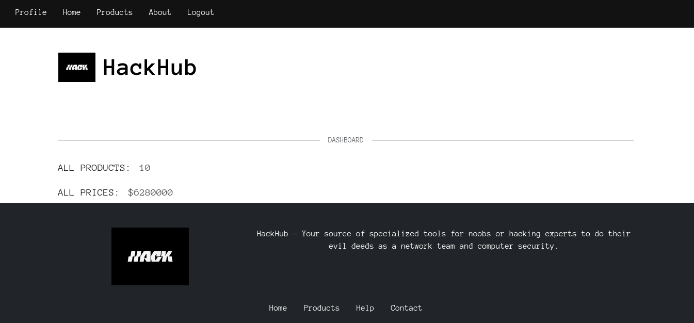

# HackHub
Hackhub is a pentesting tools app with a unique style, focused a bit on hak5. It is an app made with Nodejs, MySQL, ejs, bootstrap and adding cookies with JWT, using the passport-jwt library. It's my first backend app, a pretty complete app focused on CRUD - store.

# Comandos para ejecución
```bash
npm init -y
npm run dev
```
# SOURCE a la base de datos

# Home

